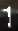
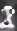
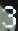
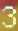
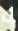
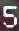
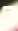
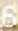
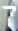
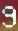

# DNoV-ElmLrf
A dataset for recognising Digital Number on Video (DNoV) with a baseline method [Elm-lrf](https://ieeexplore.ieee.org/abstract/document/7083684/).

## DNoV Dataset
This dataset contains 16765 RGB images with size 19x31. Each image is a cropping from a video frame; and that cropping displays a certain digital number. The images are with various backgrounds and different noise intensity. Some numbers are not exactly centered in the image. The dataset contains:

- **data.zip**: all images in jpg format.
- **data_index.txt**: the index of images together with their labels.
- **data_sample**: some sample images (see the table below).

| Label        | Samples           |
| ------------- |:-------------:|
| 0      |   |
| 1      |   |
| 2      |   | 
| 3      |   |
| 4      |   |
| 5      |   | 
| 6      |   |
| 7      |   | 
| 8      |   |
| 9      |   |

## Baseline Classification Model
We provide a baseline model (Elm-lrf) trained on this dataset