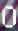
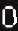
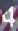

# DNoV-ElmLrf
A dataset for recognising Digital Number on Video (DNoV) with a baseline method [Elm-lrf](https://ieeexplore.ieee.org/abstract/document/7083684/).

## DNoV Dataset
This dataset contains 16765 RGB images with size 19x31. Each image is a cropping from a video frame; and that cropping displays a certain digital number. The images are with various backgrounds and different noise intensity. Some numbers are not exactly centered in the image. The dataset contains:

- **data.zip**: all images in jpg format.
- **data_index.txt**: the index of images together with their labels.
- **data_sample**: some sample images (see the table below).

| Label        | Samples           |
| ------------- |:-------------:|
| 0      |   |
| 1      |   |
| 2      |   | 
| 3      |   |
| 4      |   |
| 5      |   | 
| 6      |   |
| 7      |   | 
| 8      |   |
| 9      |   |

## Baseline Classification Model
We provide a baseline model (Elm-lrf) trained on this dataset. The training/testing is recommended to be done in either Octave or Matlab. I also created a c++ implementation of using the trained model to identify time display on video frames.

### Data preprocessing
```
# The pre-processed data will be stored in file raw.mat
octave genRawData.m
```

### Train model
```
# The trained model is stored in file baseline_models/tmodel.mat
octave start_train.m
```
If everything works, you would be able to see training printouts with metrics:
```
Training error: 0.004772
Training Time:83.597547s
```
Note:   
- To evaluate the model on test set, use script evaluate_tmodel.m
- To split the dataset, use script genTrainTestSplit.m
- By changing the probability threshold, we obtain the following chart depicting how precision and recall changes in relation to threshold.


### Transcode model
This is mandatory if you want to use the trained model in a c++ application (i.e. the example project in folder application).
```
# transcode 'baseline_models/tmodel.mat' to 'baseline_models/model.yml'
octave dlwdata
```

### Example application
Recognize the digital time on video frames. Open file application/NumReg.xcodeproj in xcode with opencv2 lib properly configured. With the following example input frame   
,   
the program will output the correct (hopefully) time (12:25:10):
```
./input.jpg
Predicted Numbers = [1][2][2][5][1][0]
fConf = 0.974932
```
